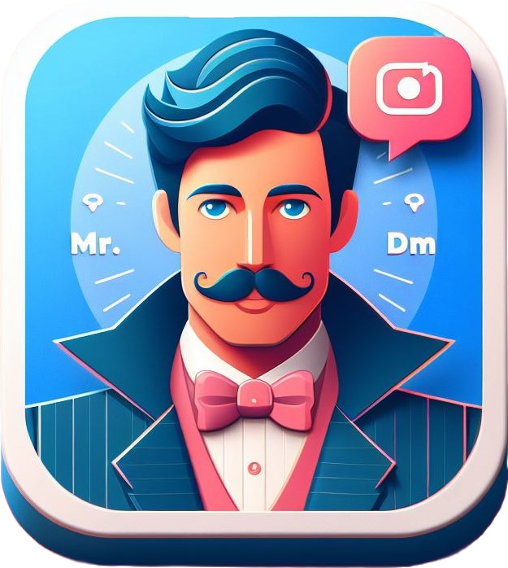

<a name="readme-top"></a>

[![Contributors][contributors-shield]][contributors-url]
[![Forks][forks-shield]][forks-url]
[![Stargazers][stars-shield]][stars-url]
[![Issues][issues-shield]][issues-url]
[![MIT License][license-shield]][license-url]


<br />
<div align="center">
  <a href="https://github.com/oxlac/mr.dm">
    
  </a>

<h3 align="center">MR.DM</h3>

  <p align="center">
    A quick and easy tool for automating your Instagram DMs.
    <br />
    <a href="mrdm.oxlac.com"><strong>Vist the Website »</strong></a>
    <br />
    <br />
    <a href="https://www.youtube.com/watch?v=uluL4279G2A">View Demo</a>
    ·
    <a href="https://github.com/oxlac/mr.dm/issues">Report Bug</a>
    ·
    <a href="https://github.com/oxlac/mr.dm/issues">Request Feature</a>
  </p>
</div>

<details>
  <summary>Table of Contents</summary>
  <ol>
    <li>
      <a href="#about-the-project">About The Project</a>
      <ul>
        <li><a href="#features">Features</a></li>
      </ul>
      <ul>
        <li><a href="#built-with">Built With</a></li>
      </ul>
    </li>
    <li>
      <a href="#getting-started">Getting Started</a>
      <ul>
        <li><a href="#installation">Installation</a></li>
      </ul>
    </li>
    <li><a href="#usage">Usage</a></li>
    <li><a href="#roadmap">Roadmap</a></li>
    <li><a href="#contributing">Contributing</a></li>
    <li><a href="#license">License</a></li>
    <li><a href="#contact">Contact</a></li>
    <li><a href="#acknowledgments">Acknowledgments</a></li>
  </ol>
</details>


## About The Project

[![MR.DM Screen Shot][product-screenshot]](https://mrdm.oxlac.com)

MR.DM is a tool for automating your Instagram DMs. Sending marketing messages about your newly launched products to your followers is a tiring proces to accomplish manually. MR.DM can sole all of that in just 3 simple steps.

1. Login to your Instagram account.
2. Load the Accounts you want to send the message to from various sources.
3. Enter the message you want to send and click send.

MR.DM will take care of the rest. It will send the message to all the accounts you have loaded.

<p align="right">(<a href="#readme-top">back to top</a>)</p>

### Features

* Send messages to thousands of accounts.
* Multiple accounts support.
* Load target accounts from followers, following, hashtag(coming soon)
* Manually add accounts to send messages to.
* Eport and import target accounts as CSV files.
* Send multiple messages to the same account.
* Send Links, posts and normal text messages.
* Send pictures and videos(coming soon)
* Monitor the progress of the messages being sent.

### Built With

* [Python](https://www.python.org/)
* [Selenium](https://www.selenium.dev/)
* [Kivy](https://kivy.org/)
* [KivyMD](https://kivymd.readthedocs.io/en/latest/)
* [InstaLoader](https://instaloader.github.io/)

<p align="right">(<a href="#readme-top">back to top</a>)</p>


## Getting Started

MR.DM is a desktop application. It is available for Windows, Linux and Mac. You can download the latest executable version from [github releases](https://github.com/oxlac/mr.dm/releases). Or you can build it from source
with the following instructions.


### Installation

1. Clone the repo
   ```sh
   git clone https://github.com/oxlac/mr.dm.git
   ```
2. Install Requirements
   ```sh
    pip install -r requirements.txt
   ```
3. Run the app
   ```sh
    python main.py
   ```


<p align="right">(<a href="#readme-top">back to top</a>)</p>


<!-- USAGE EXAMPLES -->
## Usage

MR.DM can be used for sending out messages to thousands of your followers and also other accounts. It was created for educational purposes only. Please use it responsibly. Below are the various steps to use MR.DM.

1. Login to your Instagram account.

![Login Screen][login-screenshot]
![Login Screen 2][login-screenshot2]

2. Load the Accounts you want to send the message to from various sources.

![Load Accounts Screen][load-accounts-screenshot]

3. Enter the message you want to send and click send.

![Send Message Screen][send-message-screenshot]

You can view the status of the messages being sent in the progress screen. MR.DM uses selenium to automate the process of sending messages. So you can use your computer while the messages are being sent. But please do not close the browser window that opens up. You can minimize it though.

![Progress Screen][progress-screenshot]


<p align="right">(<a href="#readme-top">back to top</a>)</p>


## Roadmap

- [ ] Add Accounts that have posted with a specific hashtag. (In Progress)
- [ ] Add Accounts that have interacted with certain hashtags. (In Progress)
- [ ] Add an account from their instagram profile link.
- [ ] Add accounts that have interacted with a specific post.
- [ ] Ability to send pictures and videos. (Need Contributors)
- [ ] Cleaning up Documentation and Adding Sphinx Autodoc. ( Under Progress)

See the [open issues](https://github.com/oxlac/mr.dm/issues) for a full list of proposed features (and known issues). If you have any other ideas, please open an issue and let us know.

<p align="right">(<a href="#readme-top">back to top</a>)</p>


## Contributing

Contributions are what make the open source community such an amazing place to learn, inspire, and create. Any contributions you make are **greatly appreciated**.

If you have a suggestion that would make this better, please fork the repo and create a pull request. You can also simply open an issue with the tag "enhancement".
Don't forget to give the project a star! Thanks again!

1. Fork the Project
2. Create your Feature Branch (`git checkout -b feature/AmazingFeature`)
3. Commit your Changes (`git commit -m 'Add some AmazingFeature'`)
4. Ensure that your code passes the ruff linter. If it does not pass view the errors and fix them.
4. Push to the Branch (`git push origin feature/AmazingFeature`)
5. Open a Pull Request

<p align="right">(<a href="#readme-top">back to top</a>)</p>


## License

Distributed under the MIT License. See `LICENSE.txt` for more information.

<p align="right">(<a href="#readme-top">back to top</a>)</p>


## Contact

Your Name - [@Oxlac_](https://twitter.com/Oxlac_) - contact@oxlac.com

Project Link: [https://github.com/oxlac/mr.dm](https://github.com/oxlac/mr.dm)

<p align="right">(<a href="#readme-top">back to top</a>)</p>


<!-- MARKDOWN LINKS & IMAGES -->
<!-- https://www.markdownguide.org/basic-syntax/#reference-style-links -->
[contributors-shield]: https://img.shields.io/github/contributors/oxlac/mr.dm.svg?style=for-the-badge
[contributors-url]: https://github.com/oxlac/mr.dm/graphs/contributors
[forks-shield]: https://img.shields.io/github/forks/oxlac/mr.dm.svg?style=for-the-badge
[forks-url]: https://github.com/oxlac/mr.dm/network/members
[stars-shield]: https://img.shields.io/github/stars/oxlac/mr.dm.svg?style=for-the-badge
[stars-url]: https://github.com/oxlac/mr.dm/stargazers
[issues-shield]: https://img.shields.io/github/issues/oxlac/mr.dm.svg?style=for-the-badge
[issues-url]: https://github.com/oxlac/mr.dm/issues
[license-shield]: https://img.shields.io/github/license/oxlac/mr.dm.svg?style=for-the-badge
[license-url]: https://github.com/oxlac/mr.dm/blob/master/LICENSE.txt
[linkedin-shield]: https://img.shields.io/badge/-LinkedIn-black.svg?style=for-the-badge&logo=linkedin&colorB=555
[linkedin-url]: https://linkedin.com/in/linkedin_username
[product-screenshot]: assets/main_image.png
[login-screenshot]: assets/login.png
[login-screenshot2]: assets/login_2.png
[load-accounts-screenshot]: assets/main_image.png
[send-message-screenshot]: assets/send_message.png
[progress-screenshot]: assets/progress.png